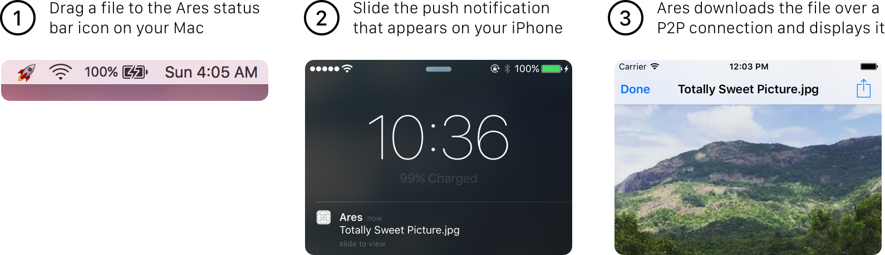

# 🚀 Ares
**Zero-setup<sup>*</sup> P2P file transfer between Macs and iOS devices**

Ares is a service that I built in under 24 hours, winning first place at [HackED 2016](http://eceweek.compeclub.com/hackathon/) during the University of Alberta's ECE Week.

[**Presentation Slides**](https://speakerdeck.com/indragiek/ares-at-hacked-2016)

**⚠️ Ares is a proof-of-concept tech demo. It is neither secure nor bug-free enough to be used in production. ⚠️**

<sup>* Zero-setup refers to the lack of setup when sending or receiving a file (e.g. opening the AirDrop tab in a Finder window, opening an email client, browsing for files in Dropbox for iOS, etc.), *not* the initial process of installing and setting up the Ares apps</sup>

### Motivation

The existing options for trasferring a file from a Mac to an iOS device (or vice versa) are clumsy or simply unreliable. I Commonly used methods like emailing a file to yourself or using Dropbox are inconvenient because the data has to be uploaded to an intermediary before it can be received by the target device. Apple's own AirDrop is often very unreliable, and the UX is less than ideal. Why do I have to open AirDrop in a Finder tab and *wait* for the devices to discover each other, which sometimes doesn't happen, in order to start a file transfer?

Ares is a technology demo that shows how much more streamlined the entire process could be.

### Using Ares

<p align="center">
  
</p>

### Setting Up

#### Back-end

I will not be providing a hosted service that can be used directly at this time due to security concerns. You are free to set up your own instance of the back-end, which is a [Node.js](https://nodejs.org/en/) application that was built to be deployed using [Heroku](https://heroku.com) and [MongoLab](https://mongolab.com/). Follow these steps to deploy your own Ares server instance:

##### Heroku

1. Fork the repository and clone it
2. [Set up APNS](https://github.com/dkhamsing/apns-guide), copy the `key.pem` and `cert.pem` files (named exactly that way) to the `/server` directory, and commit them
3. With the [Heroku Toolbelt](https://toolbelt.heroku.com/) installed, run the following commands from the root directory of the repository:

```
$ heroku login
$ heroku create
$ heroku addons:create mongolab:sandbox
$ heroku config:set APP_SECRET=$(uuidgen)
$ git subtree push --prefix server heroku master
```

##### Running Locally

```
$ cd server
$ npm install
$ export MONGOLAB_URI=$(heroku config:get MONGOLAB_URI)
$ export APP_SECRET=$(heroku config:get APP_SECRET)
$ node index.js
```

Replace the `MONGOLAB_URI` and `APP_SECRET` definitions with your own values if you did not deploy the application on Heroku.

#### iOS and Mac apps

Both the iOS and Mac application targets are set up in `client/Ares.xcodeproj`. The iOS-specific code is in the `client/iOS` directory, and the Mac-specific code is in `client/Mac`. `client/AresKit` contains the source for `AresKit`, a cross platform framework containing all of the code shared between the iOS and Mac clients.

Before building and running the apps, the `DefaultAPIURL` in `client/AresKit/Client.swift` will need to be changed to point to the URL for your Heroku instance, which can be obtained by running `heroku apps:info`.

### Future Ideas

- Bidirectional file transfer: iOS → Mac transfers in addition to the Mac → iOS transfer implemented currently
- A full file manager in the iOS app that lets you view and catalogue files that were previously downloaded over Ares
- Multiple simultaneous file transfers
- Better security in verifying origins and the integrity of delivered payloads
- Fallback to uploading files to a storage server when P2P communication is not available
- iOS action extension for sending content from 3rd party apps via Ares

### Contact

* Indragie Karunaratne
* [@indragie](http://twitter.com/indragie)
* [http://indragie.com](http://indragie.com)

### License

Ares is licensed under the MIT License. See `LICENSE` for more information.
